# Thinking-in-UML

## 一. RUP 4+1视图模型

1995年，Philippe Kruchten在《IEEE Software》上发表的《The 4+1 View Model of Architecture》
https://www.cs.ubc.ca/~gregor/teaching/papers/4+1view-architecture.pdf

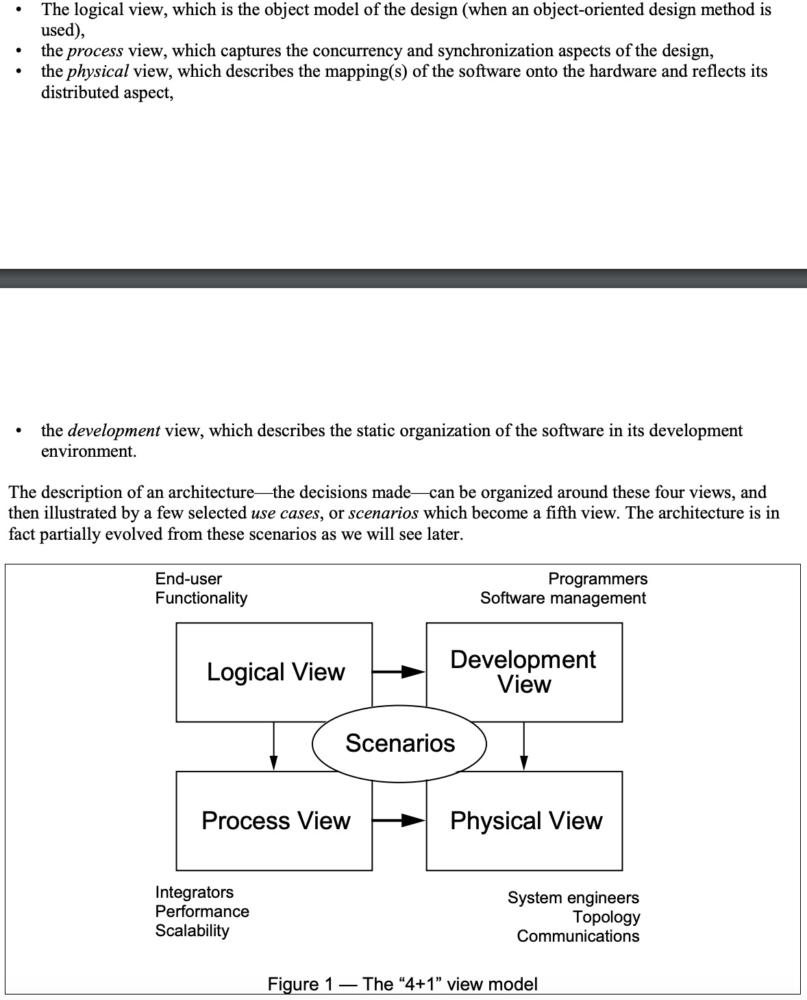


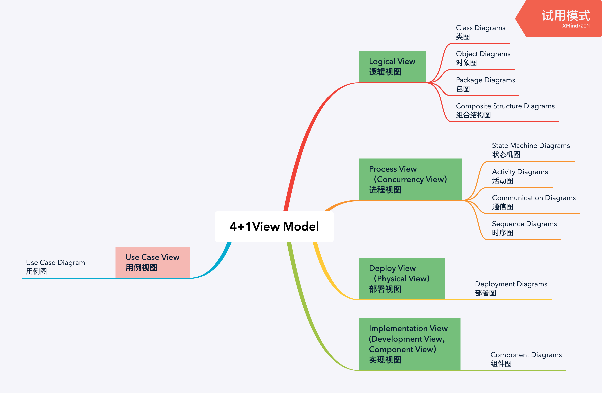

## 二. UML
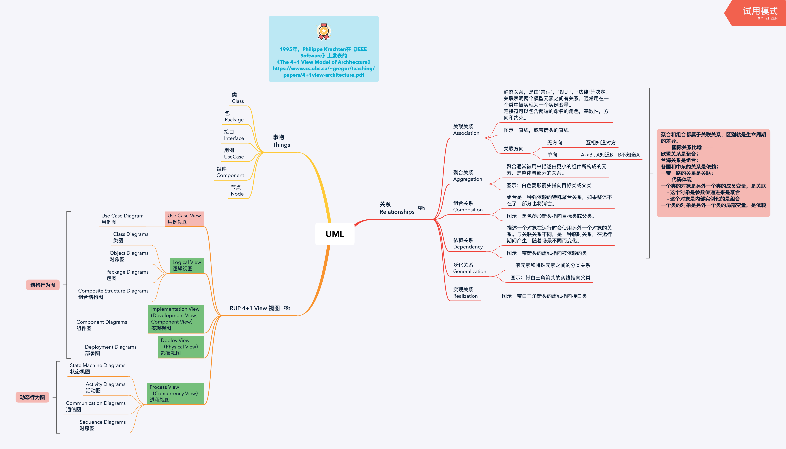


### 1. 图 Diagrams

#### 用例图 Use Case Diagram
用例图描述了一组用例,参与者以及它们之间的关系,它包含一下内容: 
* 1.用例   Use Case
* 2.参与者 Actor : 系统之外与系统交互的某人或某事物.
* 3.参与者与用例直接的关系 : 泛化关系,包含关系,扩展关系等
* 4.系统边界

##### 用例图的误区：
  ###### 1.确定系统边界，找出真正的Actor

> 例子： 小王到银行去开户，向大堂经理询问了办理手续，填写了表单，交给了柜台职员，拿到了银行卡。在这个场景中，谁是Actor？

> 问两个问题，找出Actor。
  - 谁对系统有着明确的目标和要求并且主动发出动作？
  - 系统是为谁服务的？

>所以，小王才是Actor，大堂经理和柜台职员都在系统内部，属于业务工人（business worker）,同时系统边界也明确了。 

  ###### 2. 找出真正的有效usecase
  > 误区1. 将结构当用例

  > 误区2. 将功能当用例

  > 误区3. 将步骤当用例

  ######  用例和功能的区别：
  - a、用例是描述使用者愿望的，描述的是使用者对系统的使用要求，用用例来看待系统的团队，则是从使用者角度出发，说明使用者在系统里能做什么。功能则是脱离使用者的愿望而存在的。
  - b、用例是系统性的，它描述谁在什么情况下通过什么方式得到什么样的结果。功能描述的是一个个点，如果要达成一个特定的目标，必须要再额外加上一个顺序的过程把点串联起来才能完成一个系统性的工作。而用例描述的是一个系统性的工作，这个系统性的工作非常明确地去达成一个特定的目标。
  - c、用例可以理解为一系列完成一个特定目标的“功能”的组合，针对不同的场景，这些“功能”体现不同的组合方式。

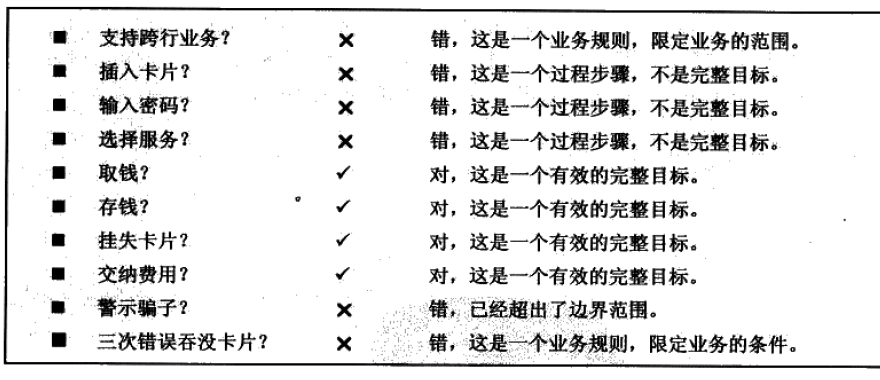

#### 类图 Class Diagram
类之间常用的关系进行了简单的描述，主要有：关联关系、泛化、依赖、聚合和组合。
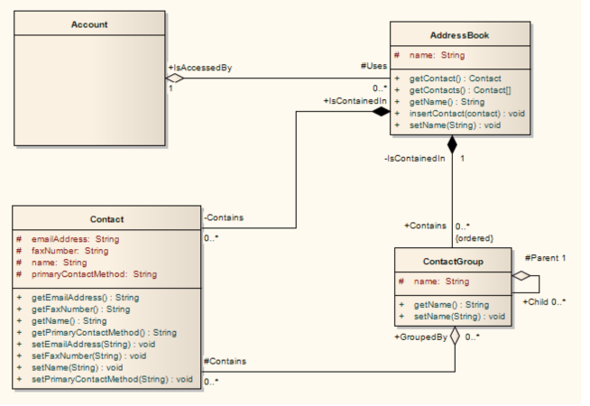

#### 活动图 Activity Diagram
> 活动图包含的图形元素有动作状态，活动状态，动作流，分支与合并，分叉与汇合，泳道和对象流等。


#### 时序图 Sequence Diagram
时序图（Sequence Diagram）是显示对象之间交互的图，这些对象是按时间顺序排列的。顺序图中显示的是参与交互的对象及其对象之间消息交互的顺序。时序图中包括的建模元素主要有：对象（Actor）、生命线（Lifeline）、控制焦点（Focus of control）、消息（Message）等等。
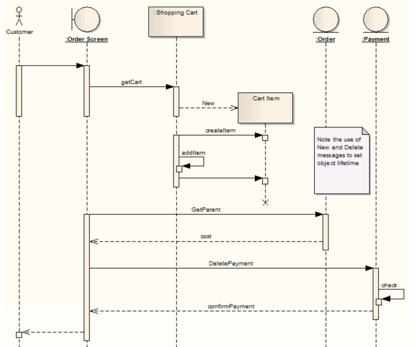

#### 组件图 Component Diagram
组件图通常包含3中元素，组件（Component），接口（interface）和依赖关系（dependency）。
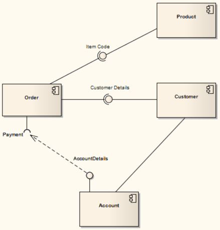

### 2. 关系 Relationship

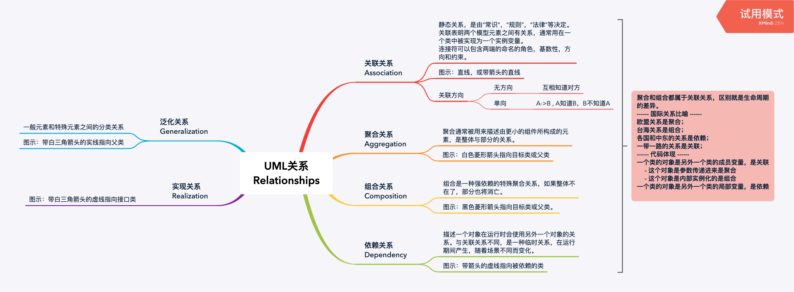

#### 关联关系 Association

**关联关系** 是静态关系，是由“常识“，“规则”，“法律”等决定。
关联表明两个模型元素之间有关系，通常用在一个类中被实现为一个实例变量。

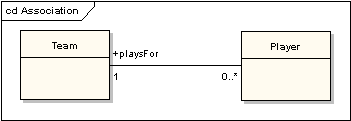

```java
class Team {   
    Player player;   
}
```
#### 聚合关系 Aggregation

**聚合关系** 通常被用来描述由更小的组件所构成的元素，是整体与部分的关系。

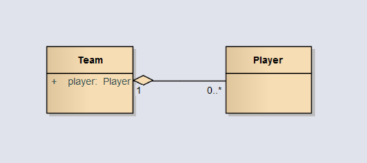
```java
class Team {   
    public Player player;   
    public void Team(Play player)
    {
        this.player = player;
    }
}
```
#### 组合关系 Composition

**组合关系**是一种强依赖的特殊聚合关系，如果整体不在了，部分也将消亡。

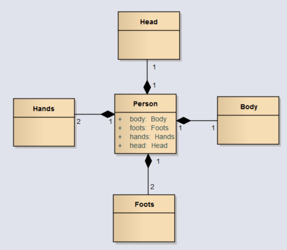
```java
class Person {   
    public Head head;   
    public Body body;   
    public Hands hands;   
    public Foots foots;   
    public void Person()
    {
        this.head = new Head();
        this.body = new Body();
        this.hands = new Hands();
        this.foots = new Foots();
    }
}
```
#### 依赖关系 Dependency

**依赖关系** 描述一个对象在运行时会使用另外一个对象的关系。
与关联关系不同，是一种临时关系，在运行期间产生，随着场景不同而变化。

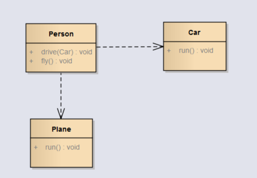
```java
class Person {   
    public void drive(Car car)
    {
        car.run();
    }
    public void fly()
    {
        Plane plane = new Plane();
        plane.run();
    }
}
```
* * *

**聚合和组合都属于关联关系，区别就是生命周期的差异。**

> 国际关系比喻 
* 欧盟关系是聚合；
* 台海关系是组合；
* 各国和中东的关系是依赖；
* 一带一路的关系是关联；
> 代码体现 
* 一个类的对象是另外一个类的成员变量，是关联
     * 这个对象是参数传递进来是聚合
     * 这个对象是内部实例化的是组合 
* 一个类的对象是另外一个类的局部变量，是依赖


#### 泛化关系 Generalization
**泛化关系**一般元素和特殊元素之间的分类关系

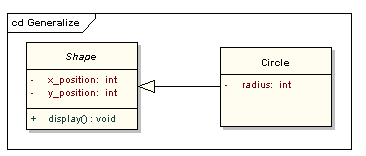
#### 实现关系 Realization

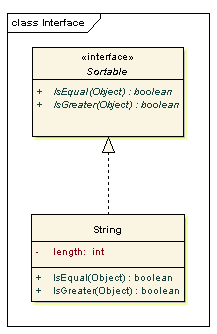

## 三. 最佳实践

### 1. 设计流程


基于4+1View，用例视图驱动整体，逻辑视图驱动了开发视图和进程视图，基于开发视图和进程视图，完成了部署视图。 
 * 用例图来驱动整体
 * 基于用例图，找出系统中的实体和实体的关系，并进行领域设计，完成类图，包图的设计。
 * 基于用例图和类图的设计，从动态视角来设计时序图和活动图，细化动态的交互。
 * 基于用例图和类图的设计，从实现的角度来完成组件图的设计
 * 基于时序图和组件图的设计，完成物理部署图。

#### - 【Use Case View】- 用例图 Use Case Diagram   
> 深入理解需求，找出actor，use case，和系统边界
#### - 【Logical View】- 类图 Class Diagram
> 根据用例，找出实体和实体关系，进行领域设计
#### - 【Process View】- 活动图 Activity Diagram [option]
> 验证用例和类图
#### - 【Process View】- 时序图 Sequence Diagram
> 用动态行为图，确认主要流程，验证类图
#### - 【Development View】- 组件图 Component Diagram
> 明确最终系统结构，指导开发，考虑组件重用。 
#### - 【Physical View】- 部署图 Deployment Diagram
> 明确物理部署

### 2. 最佳实践 Q&A:

#### 问题1. 如果就只是开发一个小模块，需要走这个流程吗？
答：我们目前大部分的开发工作中，完整的系统重新开发不是非常多，
大部分是在新系统上加功能模块。
最佳实践是 有类图和时序图，大多就能解决我们的问题。 

#### 问题2. 真的每一个开发设计都需要画这么多图吗？
答：UML图解决的是复杂的问题，如果问题比较简单，在思考和沟通上都没有问题，可以不用画。

##### 问题3. 一定要先画图后写代码吗？
答：如果是复杂系统或模块， 最佳实践是先做粗设计，用代码来验证细节和修正设计，再逐步完善设计图，最后完善代码？

#### 问题4. 是否要面面俱到的设计整个系统？
答：最佳实践是 做关键用例的设计；一些常识或者非技术风险点可以不用设计。


### 3. UDD & DDD & TDD  

*  Use-Case-Driven Development 用例驱动开发
*  Test-Driven Development 测试驱动开发
 > Kent Beck（敏捷开发的开创者&JUnit作者）于发表 2003

*  Domain-Driven Design 领域驱动设计
  
  >2004年著名建模专家Eric Evans提出

#### 最佳实践 Q&A :
##### 问题1：到底怎么做TDD？ 
答：最佳实践是，在初步设计完毕后，根据业务场景和用例来设计测试用例，（其实测试用例本身也是用例的一个实例），并实现这些用例，从而来找出设计的问题，逐步完善细节。 同时TDD还很好发现代码的耦合度的问题。 

##### 问题2：UDD和DDD 是不是有冲突？
答：在整个软件开发过程中，都需要去了解业务场景，基于场景来设计，基于场景来开发；所以领域驱动设计也需要对场景的深入理解；系统的设计也需要进行领域设计。所以不冲突。 

## 总结

UML建模简单的总结是：

***由外到内，静动结合，相互验证，逐步完善。***

```
提醒：
    - 联系实际不教条
    - 工具用来帮助思考，思考才是关键
```

```
参考资料：
《Thinking in UML》
《UML用户指南》
《UML基础与Rose建模案例》
《The 4+1 View Model of Architecture》
《SparxSystem UML2教程》
```